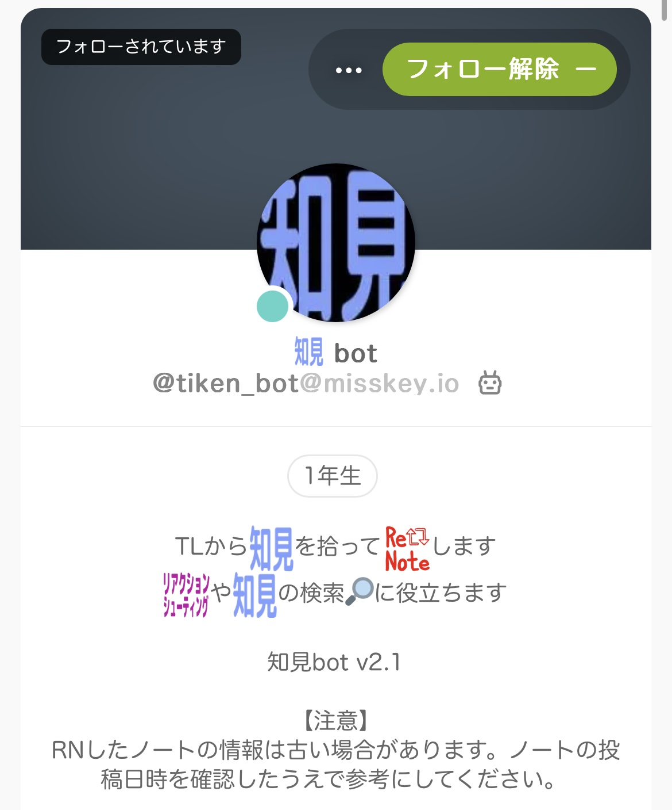

# 知見bot (tiken_bot)


# Overview
The tiken_bot is a bot account on misskey.io.
For more information about the function of the bot, please visit [@tiken_bot@misskey.io](https://misskey.io/@tiken_bot).

# Environment
- Ubuntu 22.04
- Python 3.10
- Docker 24.0.4

# Dependencies
## Python
```
$ pip install -r requirements.txt
```

## Redis
Redis is used to manage the notes that tiken_bot has already renoted and to avoid duplicate renotes.
```
$ sudo docker create --name redis-stack -p 6379:6379 redis/redis-stack:latest
```

## Elasticsearch
Elasticsearch is registered with the renoted notes and acts as an internal system for the search commands available in tiken_bot.
```
$ cd ~
$ wget https://artifacts.elastic.co/downloads/elasticsearch/elasticsearch-8.7.1-linux-x86_64.tar.gz
$ wget https://artifacts.elastic.co/downloads/elasticsearch/elasticsearch-8.7.1-linux-x86_64.tar.gz.sha512
$ shasum -a 512 -c elasticsearch-8.7.1-linux-x86_64.tar.gz.sha512
$ tar -xzf elasticsearch-8.7.1-linux-x86_64.tar.gz
$ cd ~/elasticsearch-8.7.1
$ ./bin/elasticsearch
```

After starting Elasticsearch, the Elasticsearch password will be displayed.
You can use Elasticsearch from the bot by setting this password in the `"ES_PASS"` field in the `config.json` file.

# How to launch
Run `$ source start.sh` to launch the bot.